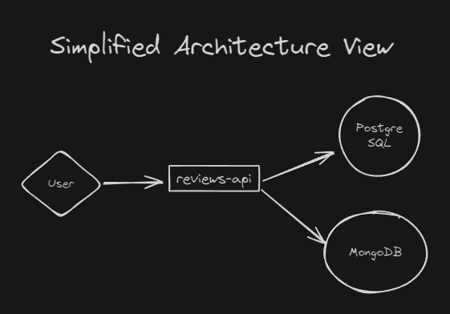

# Reviews Backend

This project provides a backend service for managing and aggregating user reviews for restaurants with the objective to measure database level aggregations (average). The service supports creating reviews, retrieving them, and calculating the average rating for a specific restaurant. The system is built using Kotlin, Spring Boot, PostgreSQL, and MongoDB.

## Architecture Diagram




## Features

- **Create Reviews:** Users can create a review for an order.
- **Retrieve Reviews:** Retrieve a review by order ID.
- **Average Rating:** Calculate the average rating for a specific restaurant based on reviews.
- **Transactional:** Reviews are saved in both PostgreSQL and MongoDB within a single transaction.
- **Testcontainers:** Integration tests are performed using Testcontainers for PostgreSQL and MongoDB containers.

## Tech Stack

- **Kotlin**: Programming language used for building the service.
- **Spring Boot**: Framework for building the backend application.
- **PostgreSQL**: Relational database for storing review data.
- **MongoDB**: NoSQL database for performing aggregations (e.g., calculating the average rating).
- **Docker & Docker Compose**: Used to containerize the services for local development and testing.
- **Testcontainers**: Library for providing integration tests using PostgreSQL and MongoDB containers.

## Setup

### Prerequisites

- Docker and Docker Compose installed.
- Java 17 installed.
- PostgreSQL and MongoDB Docker images available.

### Running the Application

```bash
# Clone the repository
git clone https://github.com/your-username/ifood-reviews.git
cd ifood-reviews

# Build the project
./gradlew build

# Start the services with Docker Compose
docker-compose up -d

# Run the application
./gradlew bootRun
```

### Curls

```text
curl -X POST http://localhost:8080/api/reviews \
  -H "Content-Type: application/json" \
  -d '{
        "orderId": "d9b2d63d-cb57-4c0a-8e8a-bb25b6f3f2b4",
        "userId": "a1f5e731-8774-42f2-bdcb-57db0edda62e",
        "restaurantId": "bcdf1d47-cfbb-4c0e-8f84-b7314e2d8e45",
        "stars": 5,
        "comment": "Great food!"
      }'
```

```text
curl -X GET http://localhost:8080/api/reviews/average/{restaurantId}
```

## K6 Performance Report

[50VUs](k6/summary-50VUs-e3b0c442-98fc-1fc1-9fd3-256e9df06d05.html)


### MEDIÇÕES DO SLA

[50VUs - create_review](k6/50VUs/createReview-summary-e3b0c442-98fc-1fc1-9fd3-256e9df06d05.html)
```text
Tipo de operações: inserção
Arquivos envolvidos (lista de Arquivos c/ os links contidos no repositório que estejam envolvidos na implementação do serviço 1)
Data da medição: 28/08/2024
Descrição das configurações (máquinas/containers utilizadas para o sistema funcionar, ...)
image: mongo:6.0
image: postgres:16.2
Core i5-13600KF
Memory Limit: 15.54GiB
RTX 4070 Ti
Potenciais gargalos do sistema: mais de 50 usuarios em concorrencia por limite de pool de conexoes, média de milhoes de reviews demoram dezenas de segundos para serem retornados.
```

[50-100-200VUs - get_review](k6/200VUs/getReview-summary2-e3b0c442-98fc-1fc1-9fd3-256e9df06d05.html)
```text
Tipo de operações: leitura
Arquivos envolvidos (lista de Arquivos c/ os links contidos no repositório que estejam envolvidos na implementação do serviço 2)
Data da medição: 28/08/2024
Descrição das configurações (máquinas/containers utilizadas para o sistema funcionar, ...)
image: mongo:6.0
image: postgres:16.2
Core i5-13600KF
Memory Limit: 15.54GiB
RTX 4070 Ti
Testes de carga (SLA): latência, vazão e concorrência (limite de requisições simultâneas)
Potenciais gargalos do sistema: mais de 200 usuarios em concorrencia por limite de CPU (atingiu 100%), média de milhoes de reviews demoram dezenas de segundos para serem retornados.
```


### Extra Performance Measurements

1.130.103 reviews latency (restaurant: e3b0c442-98fc-1fc1-9fd3-256e9df06d69):

MongoDB
```text
count: 350 ms
average: 15 s
```

Postgres
```text
count: 35 ms
average: 40 ms
```